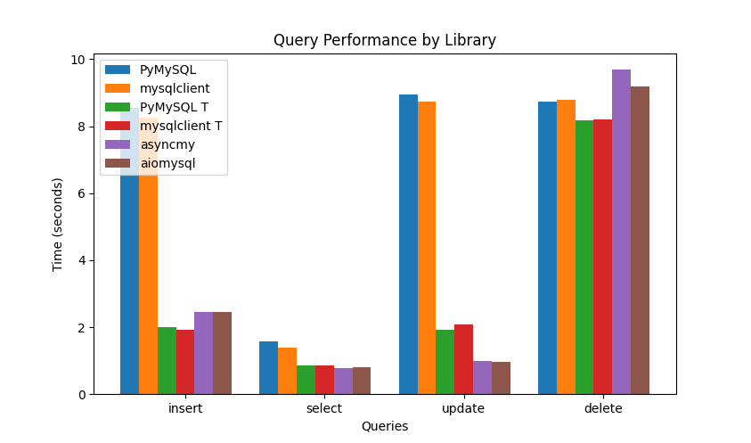

# pysql-benchmark

This repository contains the benchmark of the following solutions for mysql drivers in Python:

- PyMySQL
- PyMySQL within a threadpool
- mysqlclient
- mysqlclient within a threadpool
- aiomysql
- asyncmy

# motivation

Because the page of asyncmy offers a benchmark which is limited to a single cursor executing many queries. I wanted to get an insight about the real life use case where you use a connection pool everywhere around your code and you run many queries.
This is where this project comes into life.

# results

The benchmark has been run on a Macbook Pro M1 Pro 32GB

If you don't want to check the code, here is the logic:

- In each case, we display the time for executing 10k queries
- The insert, update and delete queries are always comitted write after being executed.
- All the async and threaded results use connection pools (its the only way to avoid errors)

Here are the results:

# analysis

As we can see, and against what is shown on asyncmy's page, the async libraries do better than the sync libraries in what I believe is closer to the real life use case (at least for me). We can also observe that the versions running within threadpools perform better than the sync versions, but not as well as the async libraries (probably due to context switch). Both asyncmy and aiomysql have very similar performances.
So, basically, this is what I expected!

Hope this saves you some time!
